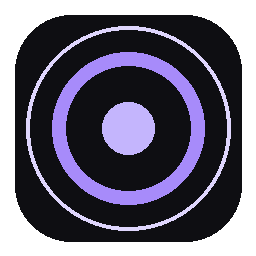

<div align="center">



# Déjà

**La tua memoria digitale per Windows.**

Déjà cattura in background ciò che vedi e ascolti sul PC, lo indicizza in locale
e ti permette di **ritrovarlo** con una ricerca semantica — o di **chiederlo** a un
assistente AI. Tipo [Rewind AI](https://www.rewind.ai/), ma open source e con i
dati che restano sul tuo computer.

</div>

---

## Cos'è

Déjà gira nel system tray e fa tre cose:

1. **Cattura** — screenshot periodici (default ogni 5s) + audio di sistema e microfono.
2. **Indicizza** — OCR sugli screenshot, trascrizione Whisper sull'audio, ed
   embedding multilingue di tutto il testo in un DB SQLite locale.
3. **Ritrova** — un overlay (`Ctrl+Shift+D`) per cercare nei tuoi ricordi con
   ricerca semantica + esatta, esplorare la timeline, o chattare con un assistente
   AI che ha accesso al tuo contesto (RAG).

Tutto l'indice vive in locale. I modelli di cattura/OCR/trascrizione girano
offline; le funzioni di chat AI opzionali usano un endpoint OpenAI-compatibile a
tua scelta — **anche locale** (Ollama / LM Studio), così nulla esce dal PC.

## Funzionalità

- 🖼️ **Cattura schermo + OCR** (`ita+eng`, Tesseract) con dedup dei frame identici.
- 🎙️ **Cattura audio** loopback di sistema + microfono, trascrizione `faster-whisper`.
- 🔎 **Ricerca ibrida** — semantica (embedding 768-dim, cosine int8 via `sqlite-vec`)
  + match esatto, con filtri per data e tipo.
- 🗂️ **Timeline "Esplora"** — sfoglia tutto per Oggi / Ieri / 7 giorni / Tutto.
- 💬 **Chat AI con RAG** — fai domande sulla tua attività; l'assistente recupera i
  ricordi rilevanti come contesto.
- 👁️ **Ask Screen** (`Ctrl+Shift+A`) — chiedi all'AI cosa c'è sullo schermo ora (vision).
- 🌍 **Multilingua** — interfaccia e ricerca in `it` / `en` / `es`.
- 🔒 **Privacy-first** — DB locale, onboarding con consenso esplicito, filtri privacy.
- 🧯 **Degradazione robusta** — se i modelli ML non caricano (es. VC++ redist mancante),
  cattura + OCR + ricerca testuale continuano a funzionare.

## Stack tecnico

| Layer | Tecnologia |
|-------|-----------|
| GUI | PyQt6 (system tray + overlay) |
| DB | SQLite WAL + [`sqlite-vec`](https://github.com/asg017/sqlite-vec) — cosine int8, 768-dim |
| Embeddings | `paraphrase-multilingual-mpnet-base-v2` (multilingue, 768-dim) |
| STT | `faster-whisper` (`large-v3-turbo`, CPU int8) |
| OCR | Tesseract (`ita+eng`) |
| Audio | `pyaudiowpatch` (loopback callback-based) |
| Chat AI | OpenAI SDK su qualsiasi endpoint OpenAI-compatibile (locale o cloud) |
| Vision | Qualsiasi modello multimodale OpenAI-compatibile (Ask Screen) |
| Hotkey | `keyboard` — `Ctrl+Shift+D` (overlay), `Ctrl+Shift+A` (ask screen) |

## Installazione (utente)

Scarica l'installer Windows dalla sezione [Releases](https://github.com/5cr1p73d/deja/releases)
(`Deja-Setup-1.0.0.exe`, ~265 MB, include il runtime VC++) ed esegui. Al primo avvio
l'onboarding chiede il consenso prima di iniziare qualsiasi cattura.

> Per l'OCR serve [Tesseract](https://github.com/UB-Mannheim/tesseract/wiki).
> Déjà lo cerca in automatico (env `TESSERACT_CMD` → `PATH` → posizioni note).

## Sviluppo

Requisiti: **Windows**, **Python 3.11+**, [Tesseract](https://github.com/UB-Mannheim/tesseract/wiki).

```powershell
git clone https://github.com/5cr1p73d/deja.git
cd deja
python -m venv venv
.\venv\Scripts\Activate.ps1
pip install -r requirements.txt
python main.py
```

Al primo avvio i modelli (embedding ~1 GB, Whisper) vengono scaricati da
HuggingFace e messi in cache.

### Configurazione AI (opzionale)

Le funzioni di chat/vision sono opzionali. Senza AI, cattura, OCR, trascrizione e
ricerca funzionano comunque.

Déjà parla con **qualsiasi endpoint OpenAI-compatibile** — locale o cloud. Non sei
legato a nessun provider: imposti Base URL + (eventuale) API Key + modello da
**Impostazioni → AI**, e il pulsante **🔄 Rileva** elenca i modelli disponibili
sull'endpoint. Il campo modello è libero: puoi digitare qualsiasi id.

#### Modelli locali (privacy totale, nessuna key)

Punta la Base URL al tuo server locale (preset già pronti in Impostazioni):

| Server | Base URL | Avvio |
|--------|----------|-------|
| [Ollama](https://ollama.com) | `http://localhost:11434/v1` | `ollama serve` |
| [LM Studio](https://lmstudio.ai) | `http://localhost:1234/v1` | avvia il server locale dall'app |

Con endpoint locale l'**API Key non serve** (lascia vuoto).

**Chat — modelli consigliati** (servono buone capacità multilingue + *tool calling*,
usato per cercare nei ricordi):

- `llama3.1:8b` — buon tool-calling, multilingue (consigliato)
- `mistral-nemo` — leggero, con tool-calling
- qualsiasi modello con *function calling* e buone capacità multilingue
- ⚠ Modelli senza supporto *function calling* funzionano per la chat libera ma **non**
  riescono a cercare automaticamente nei ricordi.

**Vision (Ask Screen) — serve un modello multimodale:**

- `llama3.2-vision:11b`
- `llava:13b` / `llava:7b`

Scarica con `ollama pull <modello>`. Regola: più grande = migliore ma più lento;
parti dalle taglie piccole se hai poca VRAM.

#### Provider cloud

Funziona qualsiasi servizio OpenAI-compatibile (OpenAI, OpenRouter, Groq, Together,
o gateway self-host). Incolla Base URL + API Key del provider e premi **🔄 Rileva**.
⚠ Con un provider cloud per la Vision, l'immagine dello schermo esce dal tuo PC.

## Comandi

| Hotkey | Azione |
|--------|--------|
| `Ctrl+Shift+D` | Apri/chiudi l'overlay di ricerca |
| `Ctrl+Shift+A` | Ask Screen — chiedi all'AI cosa c'è a schermo |
| `Esplora` | Sfoglia tutta la timeline |
| `Chat` | Apri l'assistente AI |

## Dove finiscono i dati

Tutto in una user data dir scrivibile (mai in `Program Files`):

```
%LOCALAPPDATA%\Deja\
  deja.db            indice SQLite (+ .wal, .shm)
  logs\deja.log      log applicativo
  models\            cache modelli HuggingFace (build consumer)
```

In sviluppo da sorgente, se esiste già un `deja.db` nella cartella del progetto
viene riusato quello.

## Build

```powershell
.\build.bat        # PyInstaller (onedir) → dist\
# installer: Inno Setup su deja.iss
```

## Struttura progetto

```
main.py             entry point, gestione errori + degradazione torch
config.py           costanti runtime (modelli, intervalli, endpoint)
paths.py            percorsi consumer-safe (user data dir)
db.py               schema SQLite + sqlite-vec + settings
modules/            capturer, indexer, audio, search, ai_assistant, ask_screen, privacy
ui/                 window (overlay), tray, settings, hotkey, onboarding
i18n.py             traduzioni it/en/es
obsidian/deja/      vault di documentazione interna
```

## Privacy

Déjà è progettato per restare locale: nessun upload automatico, indice solo sul tuo
PC, consenso esplicito prima di catturare. Le sole chiamate di rete sono le funzioni
AI opzionali (chat/vision) verso l'endpoint che configuri tu.

## Licenza

Vedi [`LICENSE`](LICENSE). Déjà cattura dati potenzialmente sensibili: usalo solo sui
tuoi dispositivi e nel rispetto delle leggi applicabili.
